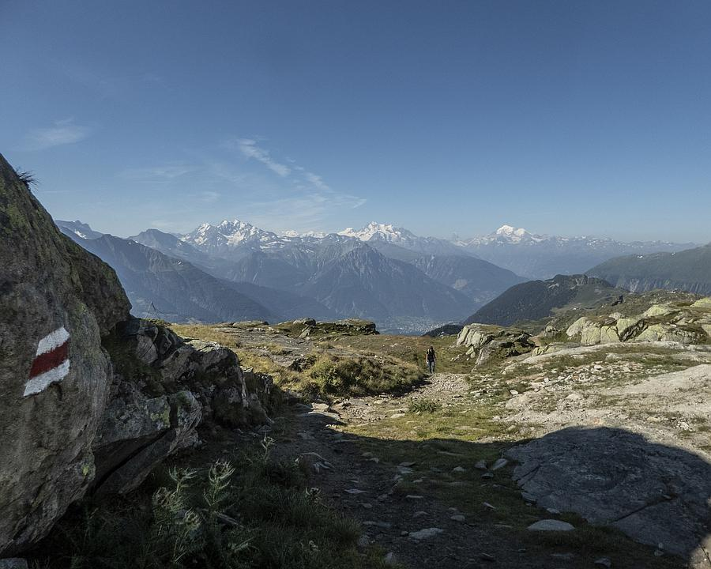

[Zurück](../../Schweizerliste.md)
# Wanderung Aletsch Panoramaweg

## Steckbrief

| **----**                 | **----**              |
| ------------------------ | --------------------- |
| **Distanz**              | 30km                  |
| **Etappen**              | 3                     |
| **Rundlauf**             | Nein                  |
| **Wegbeschafung**        | Mittel                |
| **Kondition**            | Mittel                |
| **Optimale Jahreszeit**  | Ganzjahreswanderung   |
| **Region**               | Aletsch - Wallis      |
| **Sonstige Bemerkungen** | Schnee auch im Sommer |

## Etappen
- [Tag 1: Blatten, Belalp - Riederalp, Riederfurka](Tag_1.md)
- [Tag 2: Riederalp, Riederfurka - Märjelensee](Tag_2.md)
- [Tag 3: Märjelensee - Bellwald](Tag_3.md)

## Aussicht

## Reiseinformationen
- [Hin- und Rückreise](Reise.md)

## Ressourcen
- [Weblink zur Wanderung](#)
- [Weblink zur Gondelbahn/ÖV](#)
