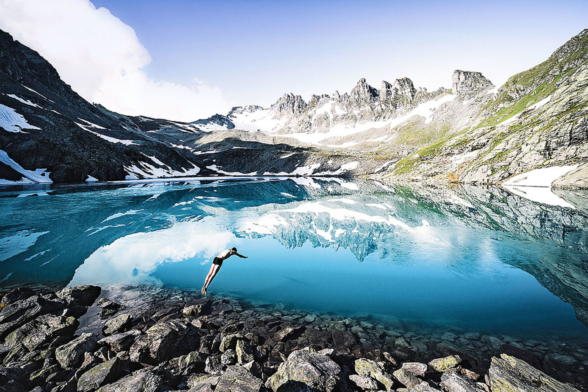
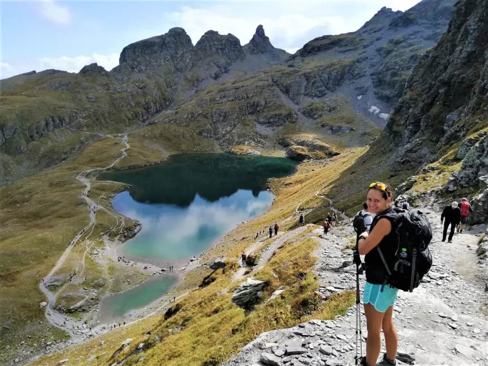
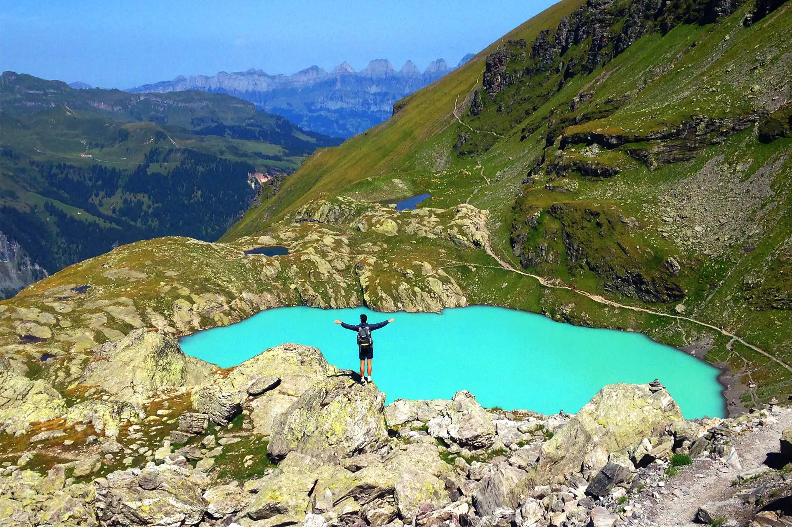

[Zurück](../../Schweizerliste.md)

<u>_**Inhaltsverzeichnis**_</u>

- [Steckbrief](#Steckbrief)
- [Aussicht und Beschreibung](#Aussicht%20und%20Beschreibung)
    - [Route](#Aussicht%20und%20Beschreibung#Route)
    - [Routenprofil](#Aussicht%20und%20Beschreibung#Routenprofil)
    - [Aussicht](#Aussicht%20und%20Beschreibung#Aussicht)
- [Anreise](#Anreise)
    - [Anreise mit der Gondelbahn](#Anreise#Anreise%20mit%20der%20Gondelbahn)
    - [Anfahrt](#Anreise#Anfahrt)

## Steckbrief

| **----**                 | **----**                                                                          |
| ------------------------ | --------------------------------------------------------------------------------- |
| **Distanz**              | 10.4 km                                                                           |
| **Zeit**                 | 4h                                                                                |
| **Rundlauf**             | Ja                                                                                |
| **Höhenmeter**           | 956 m auf, 589 m ab                                                               |
| **Wegbeschafung**        | Bergwanderweg, teils alpines Gelände                                              |
| **Kondition**            | Mittel bis anspruchsvoll                                                          |
| **Optimale Jahreszeit**  | Juni - Oktober                                                                    |
| **Region**               | Pizol - St. Gallen                                                                |
| **ÖV/Gondelbahn**        | Gondelbahn Wangs-Pizolhütte                                                       |
| **Sonstige Bemerkungen** | Panoramablick auf fünf Bergseen und die Alpen                                     |
| **Web**                  | [5-Seen-Wanderung Pizol](https://wegwandern.ch/wanderung/pizol-5-seen-wanderung/) |

## Aussicht und Beschreibung

Die 5-Seen-Wanderung am Pizol ist eine der beeindruckendsten Panorama-Touren in der Ostschweiz. Sie führt an fünf kristallklaren Bergseen vorbei und bietet atemberaubende Ausblicke auf die umliegenden Gipfel und das Rheintal. Startpunkt ist die Pizolhütte, die bequem mit der Gondelbahn erreichbar ist.

Die Wanderung beginnt mit einem Anstieg zum Wangsersee, gefolgt vom Wildsee, der auf 2438 m Höhe liegt. Hier eröffnen sich herrliche Blicke auf den Pizol-Gletscher. Weiter geht es zum Schottensee, dessen tiefblaues Wasser verzaubert. Der vierte See, der Schwarzsee, liegt ruhig in einer Mulde, bevor der Abstieg zum Baschalvasee und zur Pizolhütte erfolgt.

Die Route ist abwechslungsreich und bietet ständig wechselnde Ausblicke, von schroffen Felswänden bis hin zu sanften Wiesen. Trittsicherheit und eine gute Kondition sind erforderlich, insbesondere bei der Überquerung alpiner Passagen.

### Route

### Routenprofil

### Aussicht

## Anreise

### Anreise mit der Gondelbahn

| **----**           | **----**                                                                                                                                                 |
| ------------------ | -------------------------------------------------------------------------------------------------------------------------------------------------------- |
| **Bahn**           | Gondelbahn Wangs-Pizolhütte                                                                                                                              |
| **Kosten**         | 52.-                                                                                                                                                     |
| **Öffnungszeiten** | 8.00 – 17.00 Juni bis Oktober                                                                                                                         |
| **Bemerkung**      | Ermäßigung mit Halbtax- und GA-Karten                                                                                                                    |
| **Web**            | [Pizolbahn](https://pizol-webstore.axess.shop/de/ProductsNgTicket/TicketNonPreDateable?poolNr=70&projNr=367&ticketTypeNr=628&preDatable=False&groupId=7) |

### Anfahrt
