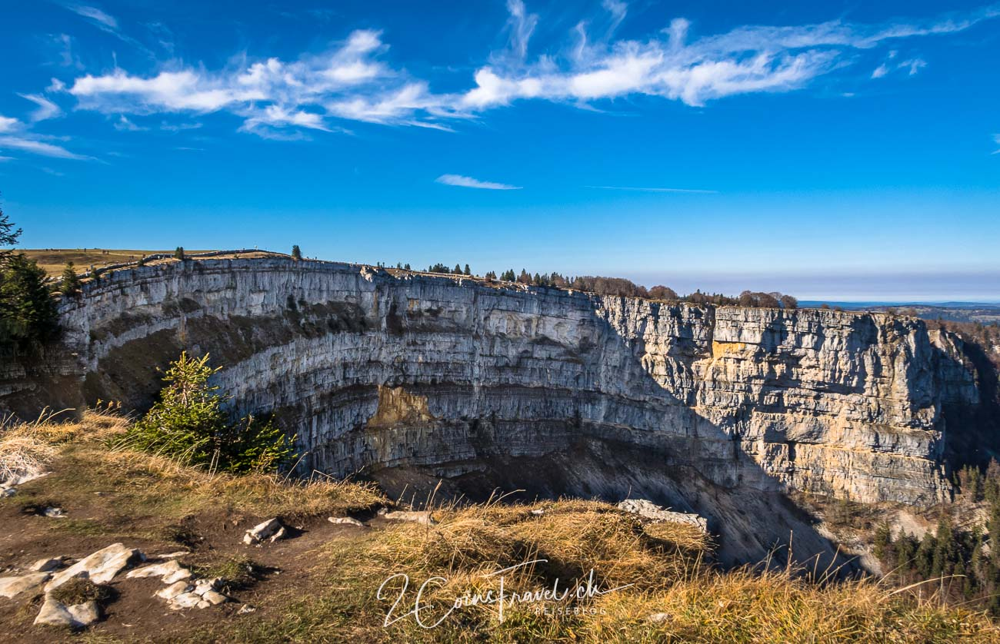
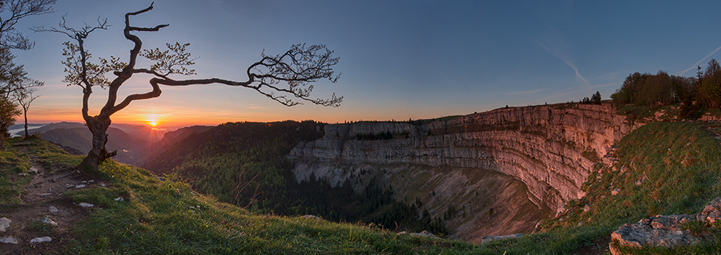
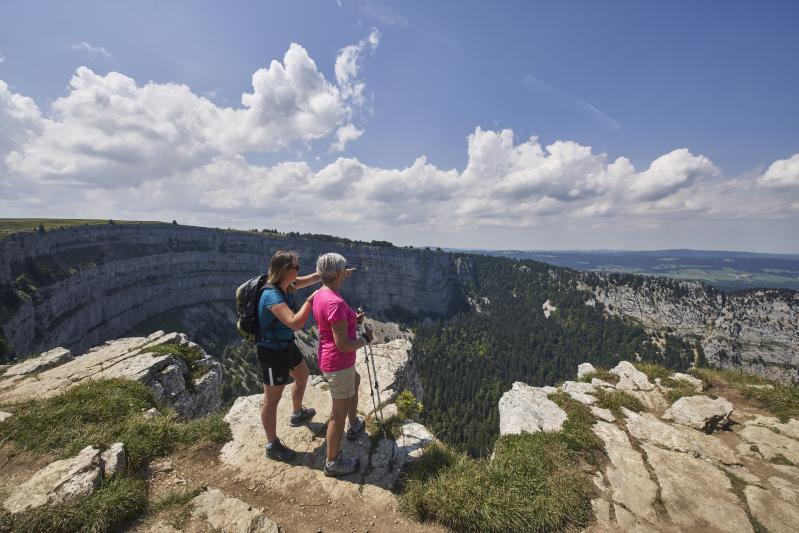
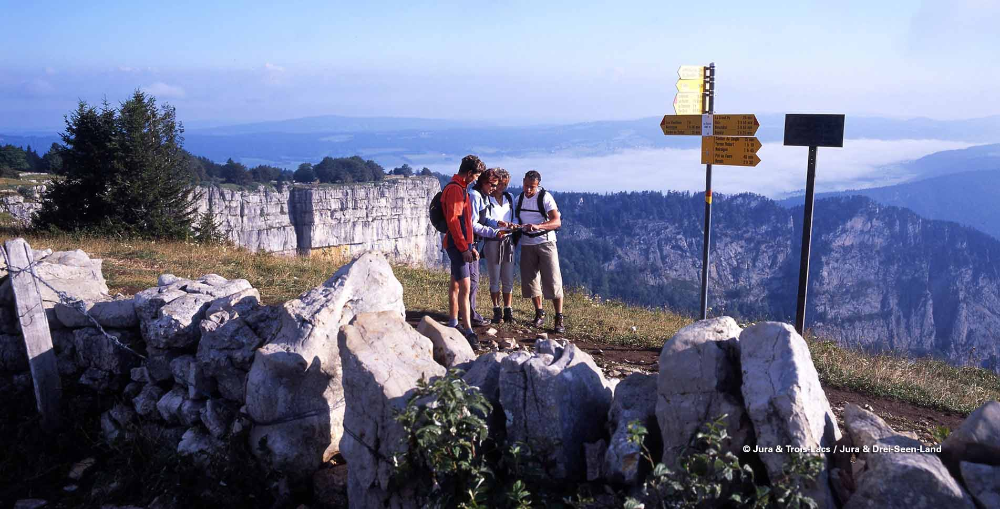
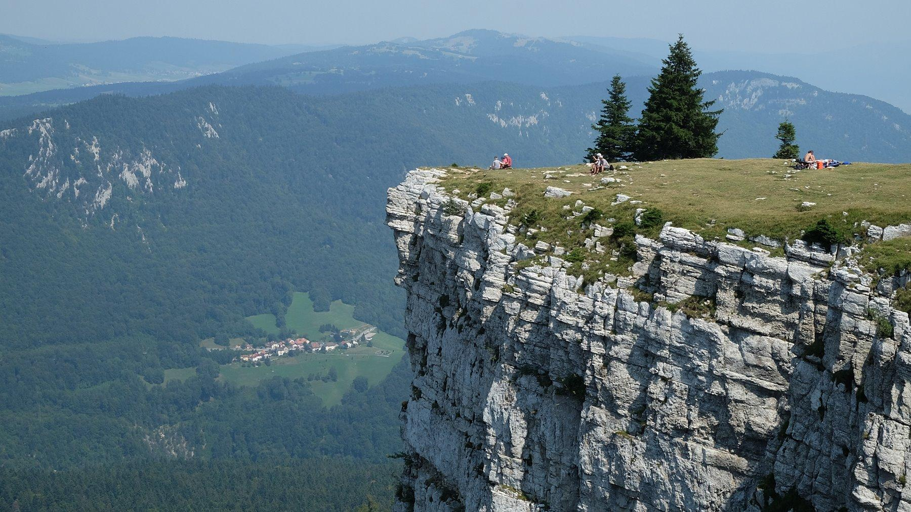
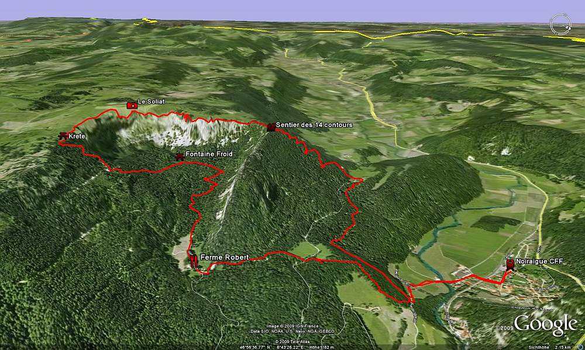

[Zurück](../../Schweizerliste.md)

<u>**Inhaltsverzeichnis**</u>
- [Steckbrief](#Steckbrief)
- [Aussicht und Beschreibung](#Aussicht%20und%20Beschreibung)
	- [Route](#Aussicht%20und%20Beschreibung#Route)
	- [Höhenprofil](#Aussicht%20und%20Beschreibung#Höhenprofil)
	- [Aussicht](#Aussicht%20und%20Beschreibung#Aussicht)
- [Anreise](#Anreise)
	- [Anreise mit der Gondelbahn](#Anreise#Anreise%20mit%20der%20Gondelbahn)
	- [Anfahrt](#Anreise#Anfahrt)

## Steckbrief
| **----**                 | **----**                                                                                                                                                               |
| ------------------------ | ---------------------------------------------------------------------------------------------------------------------------------------------------------------------- |
| **Distanz**              | 14.2km                                                                                                                                                                 |
| **Zeit**                 | 5h                                                                                                                                                                     |
| **Rundlauf**             | Ja                                                                                                                                                                     |
| **Höhenmeter**           | 769                                                                                                                                                                    |
| **Wegbeschafung**        | Bergwanderung                                                                                                                                                          |
| **Kondition**            | Mittel                                                                                                                                                                 |
| **Optimale Jahreszeit**  | Mai - Oktober                                                                                                                                                          |
| **Region**               | Val de Travers - Neuenburg                                                                                                                                             |
| **ÖV/Gondelbahn**        | Nein                                                                                                                                                                   |
| **Sonstige Bemerkungen** | Eignet sich für eine Sonnenaufgangswanderung                                                                                                                           |
| **Web**                  | [https://wegwandern.ch/wanderung/creux-du-van-im-val-de-travers-noiraigue-wandern/](https://wegwandern.ch/wanderung/creux-du-van-im-val-de-travers-noiraigue-wandern/) |

## Aussicht und Beschreibung
Besonders eindrückliche Rundwanderung auf dem spektakulärem «Grand Canyon der Schweiz»: Der Creux du Van. Eine natürliche Felsenarena im Val de Travers mit gewaltigem Ausmass: 160 Meter hohe, senkrechte Felswände umschliessen einen vier Kilometer langen und etwa einen Kilometer breiten Talkessel.

Das älteste Naturreservat der Schweiz (seit 1870) kann als Jagdbanngebiet einiges bieten: Eine arktisch-alpine Flora auf den flacheren Felsen einerseits und andererseits ist es ein Paradies für Gämse, Steinböcke, Murmeltiere, Auerhähne, Luchse, Raubvögel, Alpensegler und andere Wildtiere. Das aus der Mitte des Kessels entspringende Wasser an der _Fontaine Froide_ ist das ganze Jahr über vier Grad Celsius kalt. Den Grund kennt man bis heute nicht.
> Kopiert von "WegWander.ch"
### Route

### Höhenprofil

### Aussicht

3D-Bild der Karte

## Anreise
### Anreise mit der Gondelbahn
Keine Gondelbahn oder ähnliches steht bei dieser Wanderung zur Verfügung.
### Anfahrt 
