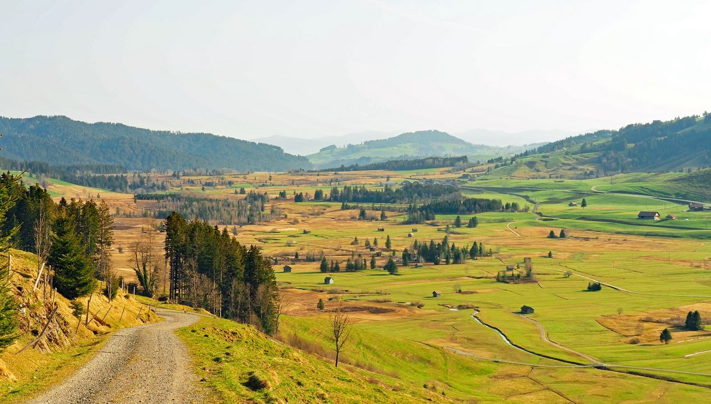
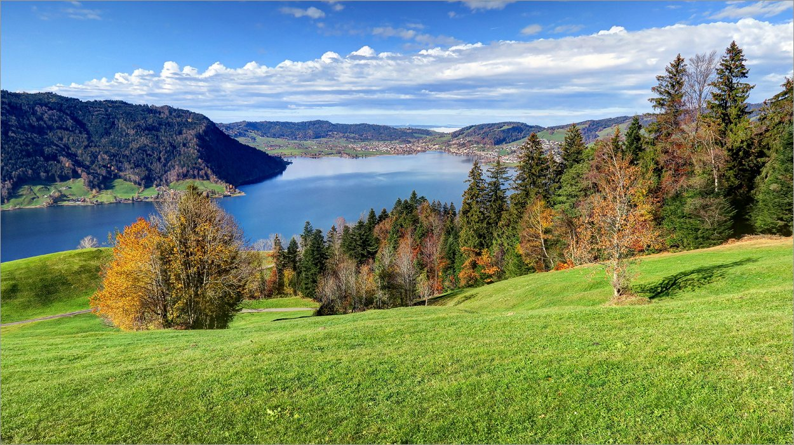
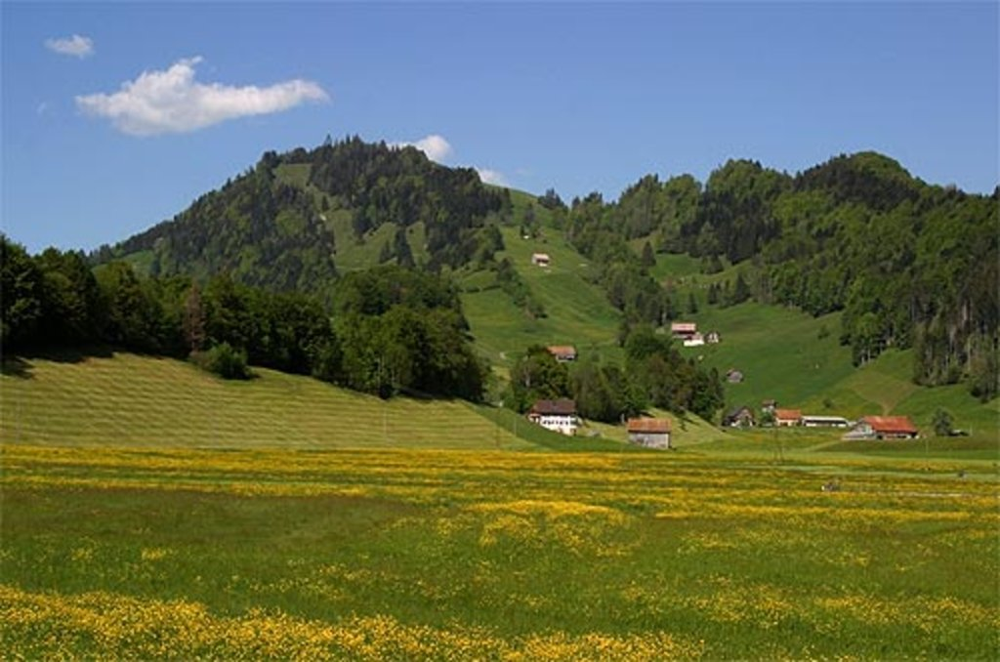

<u>_**Inhaltsverzeichnis**_</u>

- [Steckbrief](#Steckbrief)
- [Aussicht und Beschreibung](#Aussicht%20und%20Beschreibung)
    - [Route](#Aussicht%20und%20Beschreibung#Route)
    - [Routenprofil](#Aussicht%20und%20Beschreibung#Routenprofil)
    - [Aussicht](#Aussicht%20und%20Beschreibung#Aussicht)
- [Anreise](#Anreise)
    - [Anreise mit der Gondelbahn](#Anreise#Anreise%20mit%20der%20Gondelbahn)
    - [Anfahrt](#Anreise#Anfahrt)

## Steckbrief

| **----**                 | **----**                                                                                                           |
| ------------------------ | ------------------------------------------------------------------------------------------------------------------ |
| **Distanz**              | 9.3 km                                                                                                             |
| **Zeit**                 | 3h                                                                                                                 |
| **Rundlauf**             | Ja                                                                                                                 |
| **Höhenmeter**           | 360 m auf, 360 m ab                                                                                                |
| **Wegbeschafung**        | Wanderweg, teils Waldwege                                                                                          |
| **Kondition**            | Mittel                                                                                                             |
| **Optimale Jahreszeit**  | April - November                                                                                                   |
| **Region**               | Schwyz, Morgarten                                                                                                  |
| **ÖV/Gondelbahn**        | Bushaltestelle "Morgarten, Loch"                                                                                   |
| **Sonstige Bemerkungen** | Historische Sehenswürdigkeiten entlang der Route                                                                   |
| **Web**                  | [Schwyz Tourismus](https://www.schwyz-tourismus.ch/de/detail/poitype/outdooractivetour/poi/rundweg-morgartenberg/) |

## Aussicht und Beschreibung

Der Rundweg Morgartenberg ist eine faszinierende Wanderung, die nicht nur durch eine beeindruckende Landschaft führt, sondern auch tief in die Geschichte der Schweiz eintaucht. Die Wanderung beginnt in Morgarten, bekannt durch die historische Schlacht von 1315, und führt auf den Morgartenberg, von dem man eine großartige Aussicht auf den Ägerisee und die umliegenden Alpen genießt.

Der Weg ist abwechslungsreich und führt durch Wälder, über Wiesen und vorbei an historischen Stätten. Zu den Highlights gehört die Schlachtkapelle, die an die berühmte Schlacht erinnert, und die Aussichtspunkte, die atemberaubende Blicke auf den See und die Berge bieten.

Diese Wanderung ist ideal für alle, die Natur und Geschichte gleichermaßen lieben. Der moderate Anstieg macht sie zugänglich für Wanderer mit mittlerer Kondition, und die gut markierten Wege sind einfach zu folgen.

### Route

### Routenprofil

### Aussicht

## Anreise

### Anreise mit der Gondelbahn

|**----**|**----**|
|---|---|
|**Bahn**|Keine Gondelbahn erforderlich|
|**Kosten**|-|
|**Öffnungszeiten**|-|
|**Bemerkung**|-|
|**Web**|-|

### Anfahrt
