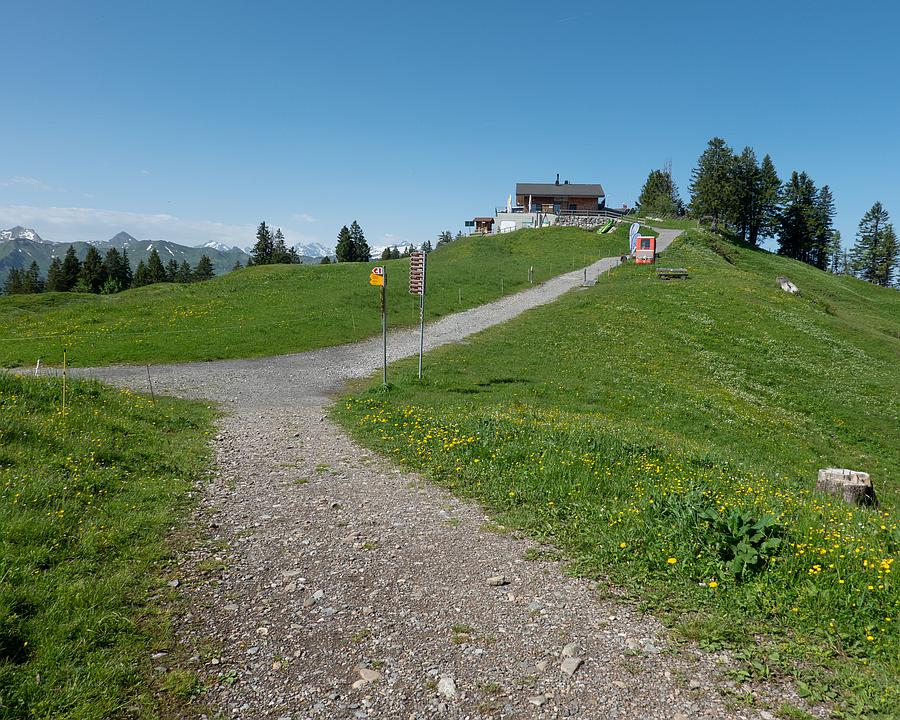
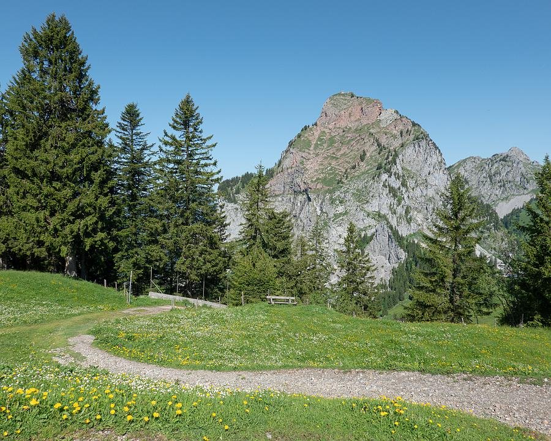
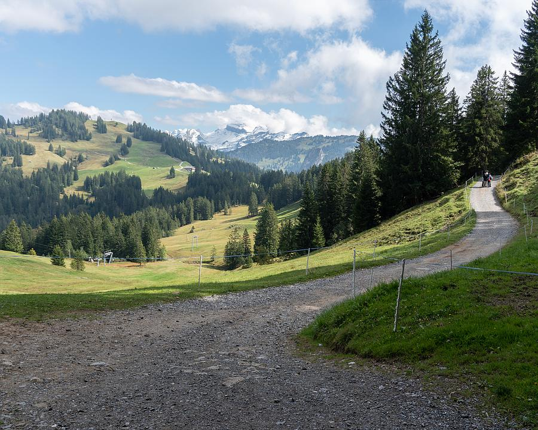
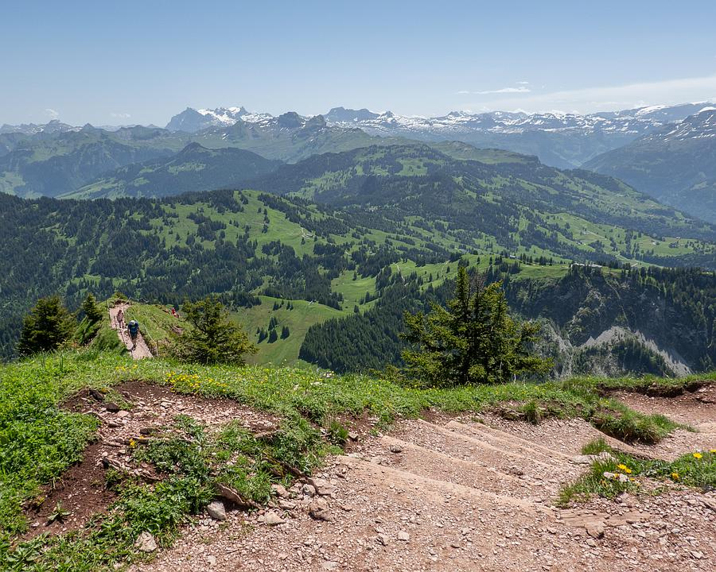
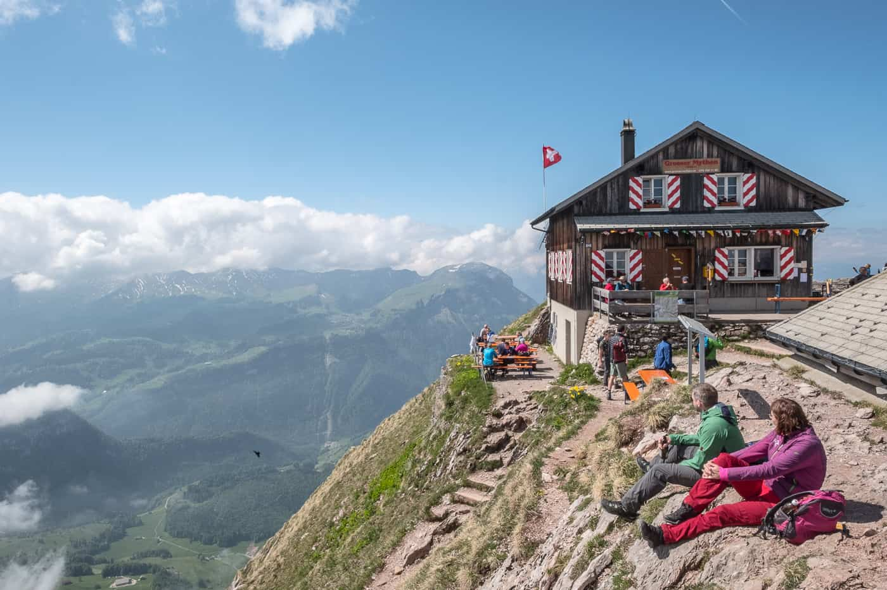
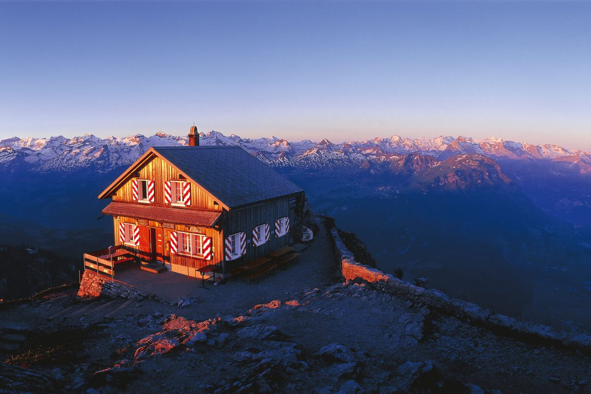

[Zurück](../../Schweizerliste.md)

<u>***Inhaltsverzeichnis***</u>
- [Steckbrief](#Steckbrief)
- [Aussicht und Beschreibung](#Aussicht%20und%20Beschreibung)
	- [Route](#Aussicht%20und%20Beschreibung#Route)
	- [Routenprofil](#Aussicht%20und%20Beschreibung#Routenprofil)
	- [Aussicht](#Aussicht%20und%20Beschreibung#Aussicht)
- [Anreise](#Anreise)
	- [Anreise mit der Gondelbahn](#Anreise#Anreise%20mit%20der%20Gondelbahn)
	- [Anfahrt](#Anreise#Anfahrt)

## Steckbrief
| **----**                 | **----**                                                                                                                |
| ------------------------ | ----------------------------------------------------------------------------------------------------------------------- |
| **Distanz**              | 6km                                                                                                                     |
| **Zeit**                 | 3h                                                                                                                      |
| **Rundlauf**             | Nein                                                                                                                    |
| **Höhenmeter**           | 660                                                                                                                     |
| **Wegbeschafung**        | Bergwanderweg                                                                                                           |
| **Kondition**            | Mittel                                                                                                                  |
| **Optimale Jahreszeit**  | Mai-November                                                                                                            |
| **Region**               | Mythen - Schwyz                                                                                                         |
| **ÖV/Gondelbahn**        | Bergstation Rotenflue für An- / Rückreise                                                                               |
| **Sonstige Bemerkungen** | Eignet sich für Sonnenaufgangs bzw Sonnenuntergangswanderung. Jedoch muss man die Verfügbarkeit der Gondelbahn beachten |
| **Web**                  | [https://schweizmobil.ch/de/wanderland/route-829](https://schweizmobil.ch/de/wanderland/route-829)                      |

## Aussicht und Beschreibung
Die beiden Mythen sind das Wahrzeichen der Gemeinde Schwyz. Markant thronen die Felspyramiden über dem Talkessel. Auf dieser Wanderung wird der Gipfel des Grossen Mythen bestiegen. Gestartet wird bequem mit einer Gondelfahrt mit der Rotenfluebahn. Mit jedem Meter, den die Kabine höher schwebt, weitet sich der Panoramablick. Oben angekommen will die Aussicht vor dem Abmarsch in aller Ruhe gewürdigt sein: Man geniesst beinahe einen Rundumblick – vom Muotatal über den Talkessel von Schwyz bis zum Grossen Mythen.

Gemütlich geht es zunächst von der Rotenflue zur Holzegg, die am Fusse des Grossen Mythen liegt. Hier beginnt der Einstieg in den Mythenweg. Weit unten liegt der Vierwaldstättersee, direkt vor der Nase ragt der Grosse Mythen in die Höhe. Der Aufstieg auf den Grossen Mythen über Serpentinen ist steil und setzt eine gute Trittsicherheit sowie Kondition voraus. Auf dem Gipfel angekommen, vielleicht noch etwas erschöpft vom Aufstieg, werden alle Anstrengungen vergessen sein. Staunen lässt einen der atemberaubende Rundblick auf die Berggipfel der Alpen, den Talkessel von Schwyz, die Zentralschweizer Seen und über die Weite des Mittellandes.
> Kopiert von "SchweizMobil"

### Route

### Routenprofil

### Aussicht

#### Aussicht von der Bergstation

#### Während der Wanderung

#### Während der Wanderung

#### Aussicht beim Gipfel

#### Aussicht beim Gipfel (-Restaurant)

#### Gipfel am Morgen

## Anreise
### Anreise mit der Gondelbahn

| **----**           | **----**                                                                   |
| ------------------ | -------------------------------------------------------------------------- |
| **Bahn**           | Rotenflue                                                                  |
| **Kosten**         | 28.-                                                                       |
| **Öffnungszeiten** | 8.30 – 17.30 9. Mai bis 27. Oktober                                     |
| **Bemerkung**      | -                                                                          |
| **Web**            | [Rotenfluebahn](https://www.mythenregion.ch/sommer/tickets/rotenfluebahn/) |

### Anfahrt 

