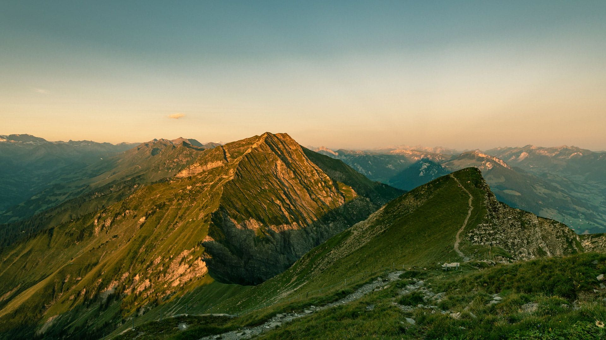
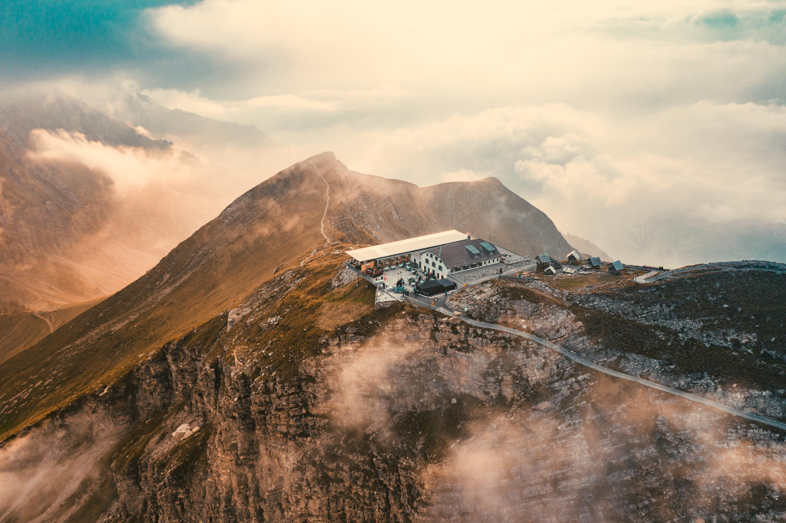
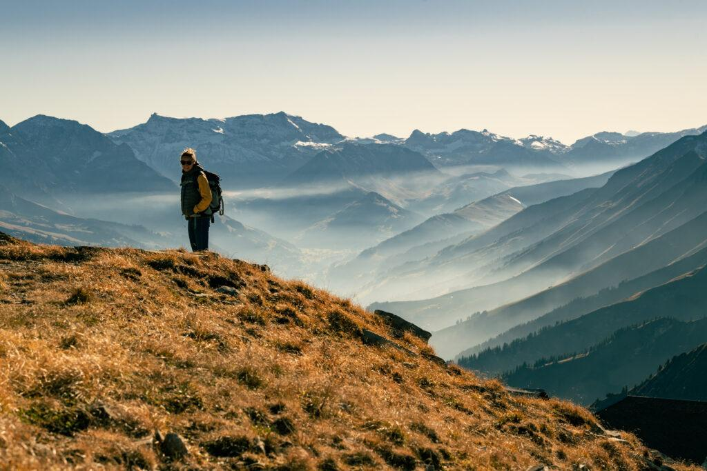
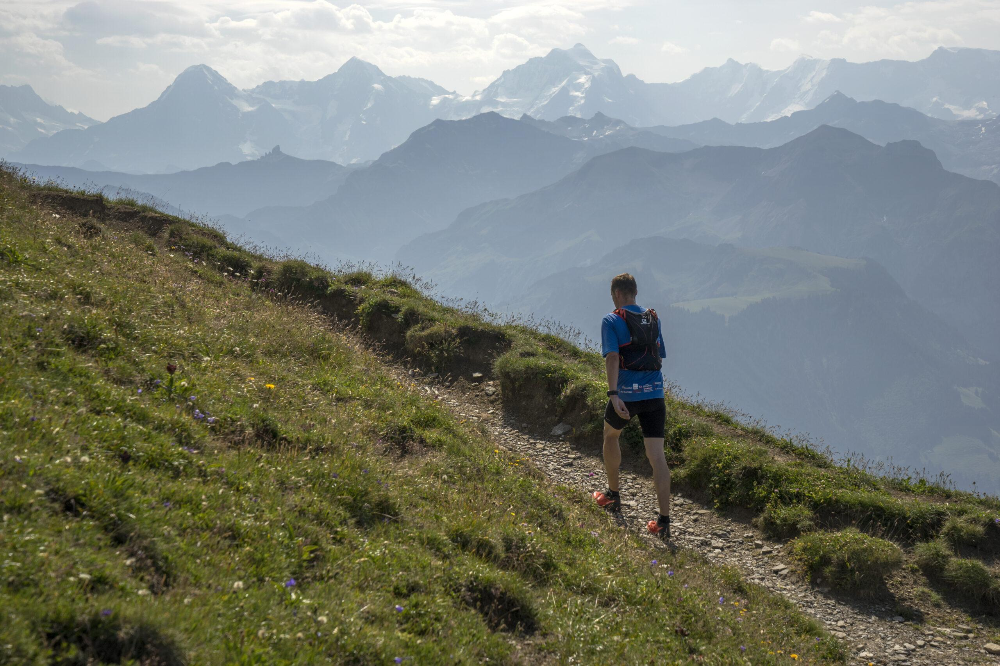

<u>_**Inhaltsverzeichnis**_</u>

- [Steckbrief](#Steckbrief)
- [Aussicht und Beschreibung](#Aussicht%20und%20Beschreibung)
    - [Route](#Aussicht%20und%20Beschreibung#Route)
    - [Routenprofil](#Aussicht%20und%20Beschreibung#Routenprofil)
    - [Aussicht](#Aussicht%20und%20Beschreibung#Aussicht)
- [Anreise](#Anreise)
    - [Anreise mit der Gondelbahn](#Anreise#Anreise%20mit%20der%20Gondelbahn)
    - [Anfahrt](#Anreise#Anfahrt)

## Steckbrief

| **----**                 | **----**                                |
| ------------------------ | --------------------------------------- |
| **Distanz**              | 11.06 km                                |
| **Zeit**                 | 4.30h                                   |
| **Rundlauf**             | Nein                                    |
| **Höhenmeter**           | 1224 m                                  |
| **Wegbeschafung**        | Bergwanderweg                           |
| **Kondition**            | Anspruchsvoll                           |
| **Optimale Jahreszeit**  | Mai - Oktober                           |
| **Region**               | Niesen - Berner Oberland                |
| **ÖV/Gondelbahn**        | Niesenbahn bis Mittelstation Schwandegg |
| **Sonstige Bemerkungen** | Beliebt für Sonnenaufgangswanderungen   |
| **Web**                  | Niesenbahn                              |

## Aussicht und Beschreibung

Der Niesen, oft als „Schweizer Pyramide“ bezeichnet, erhebt sich majestätisch über dem Thunersee und bietet eine der spektakulärsten Aussichten in den Berner Alpen. Diese Wanderung beginnt an der Mittelstation Schwandegg, die mit der Niesenbahn erreicht werden kann. Von hier aus führt der Weg in steilen Serpentinen hinauf zum Gipfel.

Der Aufstieg ist anspruchsvoll, aber der Sonnenaufgang auf dem Gipfel belohnt die Mühen reichlich. Der Blick über die Berner Alpen, den Thunersee und das Mittelland ist atemberaubend. An klaren Tagen sind sogar die fernen Jurahügel und die Alpenketten sichtbar.

Diese Wanderung ist besonders beliebt, um den Sonnenaufgang zu erleben. Frühaufsteher werden mit einem unvergesslichen Panorama belohnt, wenn die ersten Sonnenstrahlen die Berggipfel in goldene Farben tauchen.

### Route

### Routenprofil

### Aussicht

## Anreise/Abreise

### Abreise mit der Gondelbahn

| **----**           | **----**                                                |
| ------------------ | ------------------------------------------------------- |
| **Bahn**           | Niesenbahn                                              |
| **Kosten**         | 38.-                                                    |
| **Öffnungszeiten** | 8.00 – 18.00 Mai bis Oktober                         |
| **Bemerkung**      | Frühfahrten für Sonnenaufgangs-Touren nach Voranmeldung |
| **Web**            | Niesenbahn                                              |

### Anfahrt

